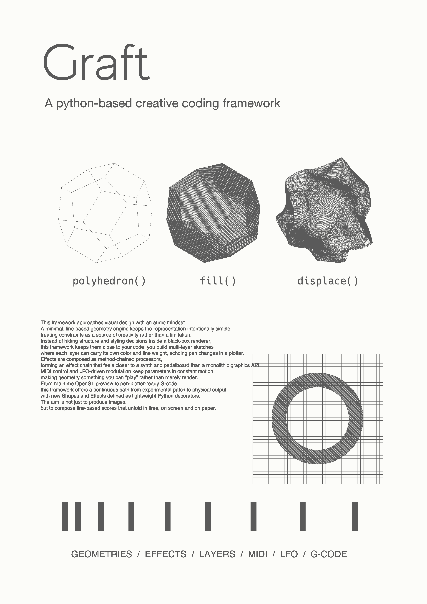

# Graft


This image was created with Graft.

Graft is a lightweight toolkit for building line-based geometries, applying chained effects, and viewing the result in real time.

Shapes and effects are registered through the public API, allowing sketches to be composed by combining `G.<shape>()` calls with pipelines built from `E.<effect>()`.

## Examples

```python
from api import E, G, run


def draw(t: float):
    poly = G.sphere()
    effect = E.affine().displace()
    return effect(poly)


if __name__ == "__main__":
    run(draw, canvas_size="A5", render_scale=10)
```

## Features

- All parameters for shapes and effects can be tweaked live through the Parameter GUI.
- `api.cc` links MIDI controllers to parameters so that sliders, knobs, or pads can drive sketches.
- `api.lfo` provides tempo-synced oscillators for modulating any numeric parameter over time.
- `api.L` defines layers, allowing colors, stroke widths, and other styling attributes to be managed per layer.
- Press `P` (`Shift+P` for high resolution) to save a screenshot, `V` (`Shift+V`) to capture a video, and `G` to export G-code for pen plotters.

## Configurations

- Default settings: `configs/default.yaml`
- Local overrides: `config.yaml` at the repository root (merged when present)

## Dependencies

- Numpy
- Numba
- scipy
- shapely
- noise
- vnoise
- ModernGL
- pyglet
- mido
- DearPyGui
