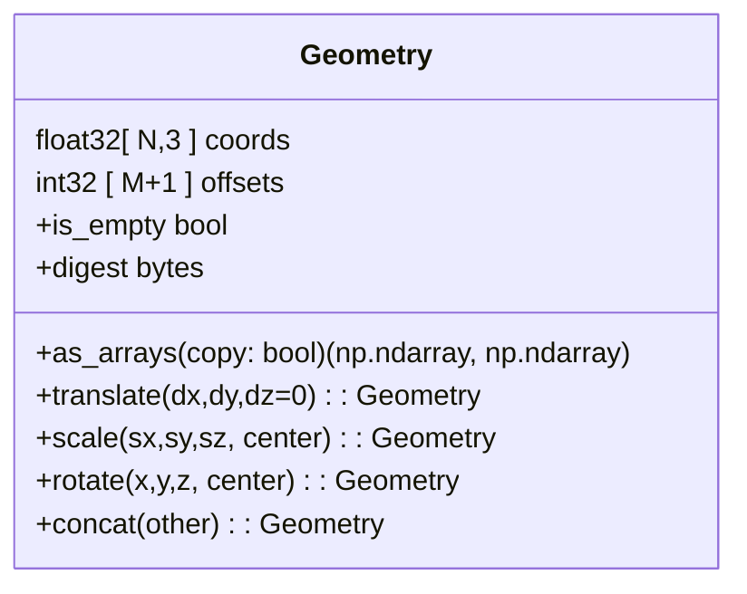
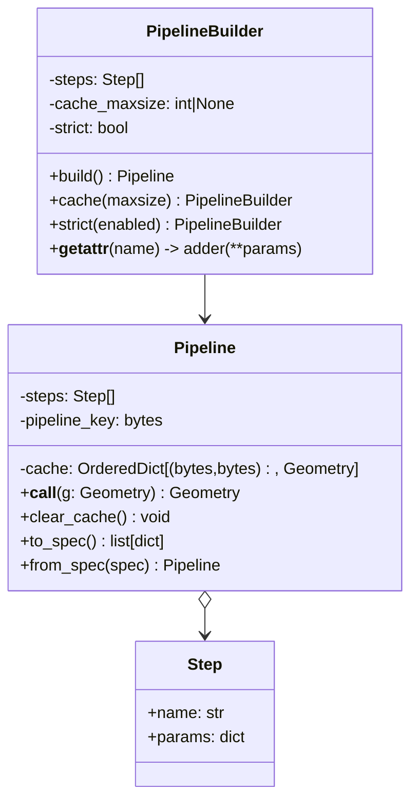
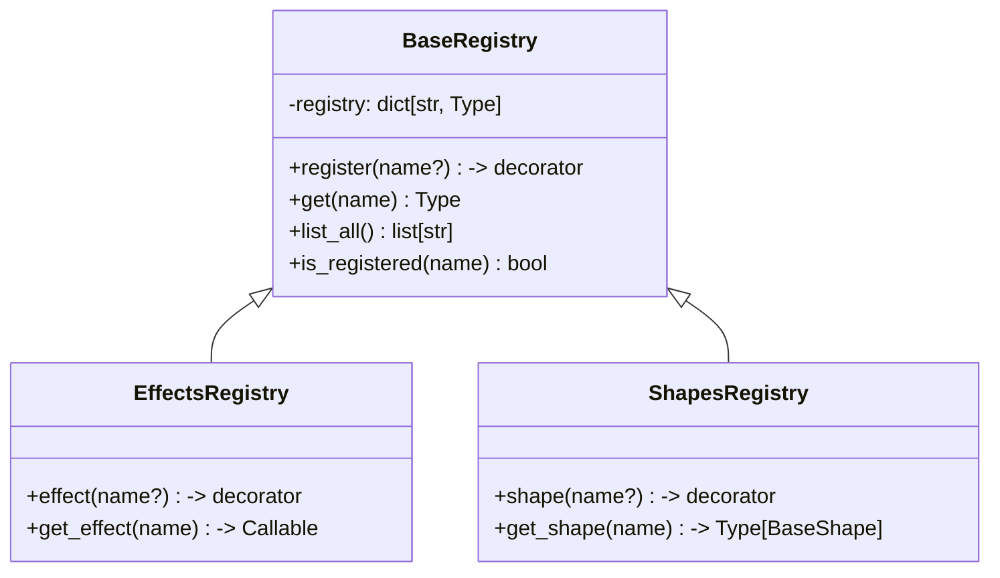
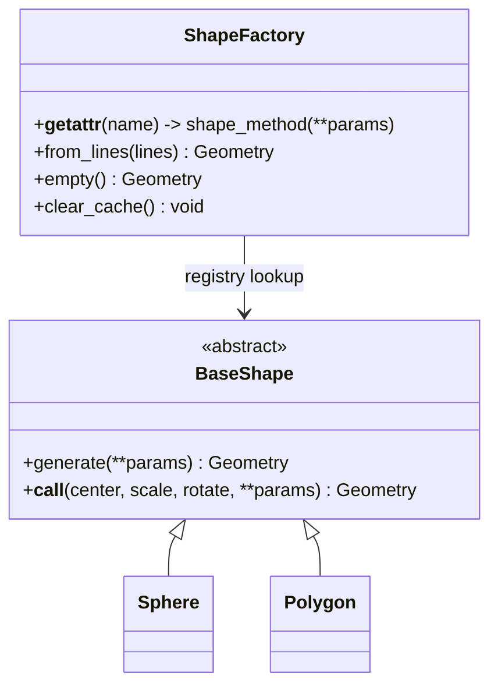
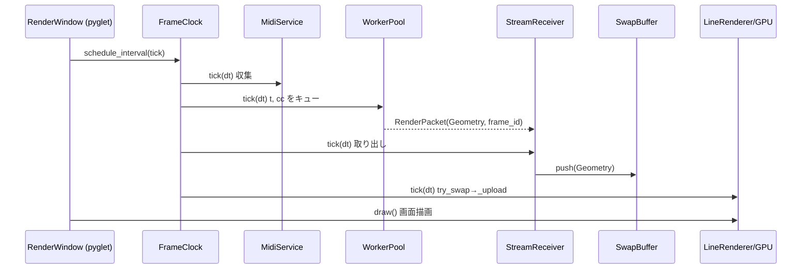

# PyxiDraw4 アーキテクチャとクラス設計ガイド

最終更新: 2025-09-04

本ドキュメントは、本プロジェクトの「統合 Geometry」「関数型エフェクト」「単層パイプライン」の方針に基づくアーキテクチャと主要クラス設計を、図解とともに俯瞰できるようまとめたものです。実装は `api/`, `engine/`, `effects/`, `shapes/` を中心に構成されます。


## TL;DR（実行フロー要約）

- 形状を生成: `G.sphere(...)-> Geometry`
- 必要なら Geometry の純関数変換: `.scale().translate().rotate().concat()`
- パイプラインを構築して適用: `(E.pipeline....build())(g) -> Geometry`
- `api.run()` でユーザ `draw(t, cc)` が並列に呼ばれ、`Geometry` が GPU にアップロードされて描画

```python
from api import G, E, run

def draw(t, cc):
    g = G.sphere(subdivisions=0.5).scale(100,100,100).translate(100,100,0)
    pipe = (E.pipeline
              .rotate(angles_rad=(0.5, 0, 0))
              .displace(amplitude_mm=0.2)
              .fill(density=0.5)
              .build())
    return pipe(g)

run(draw, canvas_size="A5", use_midi=False)
```


## ディレクトリ構成（役割）

- `api/`: 高レベル API（`G`/`E`/`run`、パイプライン組立、シリアライズ）
- `engine/`: コア（`Geometry`、変換ユーティリティ、並列実行、レンダリング、I/O、HUD など）
- `effects/`: `@effects.registry.effect` で登録される純関数エフェクト群
- `shapes/`: 形状ジェネレータ（`@shapes.registry.shape` 登録、`G` から呼び出し）
- `common/`: レジストリ、型、キャッシュ、ロギングなどの基盤
- `util/`: 幾何ユーティリティ、定数、設定ロード
- `benchmarks/`・`tests/`・`docs/adr/`: ベンチ、テスト、設計根拠（ADR）

```mermaid
graph TD
  A[User Code\napi.run(draw)] -->|calls| B[WorkerPool]
  B --> C[StreamReceiver]
  C --> D[SwapBuffer]
  D --> E[LineRenderer]
  E --> F[GPU/Window]
  subgraph Shapes/Effects
    G1[G factory\napi.ShapeFactory (G)] -->|returns| H1[Geometry]
    H1 --> I1[E.pipeline\n→ Pipeline]
    I1 --> H2[Geometry]
  end
  B -. draw(t, cc) .-> G1
  style H1 fill:#eef,stroke:#99f
  style H2 fill:#eef,stroke:#99f
```


## コアデータモデル: `Geometry`

- 単一の不変データ構造に統一（ADR 0004）。座標と折れ線境界のみを保持。
  - `coords: float32 ndarray (N,3)`
  - `offsets: int32 ndarray (M+1,)`（各ポリラインの開始 index、末尾に N）
- 変換はすべて純関数（新インスタンスを返す）
  - `translate(dx,dy,dz=0)`／`scale(sx,sy,sz, center)`／`rotate(x,y,z, center)`／`concat(other)`
- キャッシュ用ダイジェスト `digest: bytes`（env `PXD_DISABLE_GEOMETRY_DIGEST=1` で無効化可）



設計意図:
- 表現を一本化することで、エフェクト・パイプライン・GPU 転送の境界摩擦を排除。
- 変換は副作用ゼロで合成可能（テスト容易、バグ追跡容易）。


## エフェクトとパイプライン

- エフェクトは「関数」だけ（`Geometry -> Geometry`）。クラス継承は廃止（ADR 0003）。
- `@effects.registry.effect()` で名前を登録。エイリアスは不採用、キーは正規化（`CamelCase`→`snake_case`）。
- `E.pipeline ... .build()` が `Pipeline` を返す。`Pipeline(g)` で逐次適用。
- 単層キャッシュ（ADR 0005）: 鍵は `(geometry_digest, pipeline_key)`
  - `pipeline_key` は各ステップの「関数バイトコード + パラメータ正規化値」から算出
  - 上限は `PXD_PIPELINE_CACHE_MAXSIZE`（未設定時は無制限相当）。`Pipeline.clear_cache()` で明示クリア
- 仕様のシリアライズ/検証（ADR 0002/0008）
  - `to_spec(pipeline) -> [{name, params}]`
  - `from_spec(spec) -> Pipeline`（内部で `validate_spec` 実行）
  - `validate_spec` は未登録名/未知キー/型・範囲（`__param_meta__`）を早期検出



検証の例:

```python
from api import E, to_spec, from_spec, validate_spec

pipe = (E.pipeline.rotate(angles_rad=(0.5,0,0))
                 .displace(amplitude_mm=0.2)
                 .build())
spec = to_spec(pipe)
validate_spec(spec)
pipe2 = from_spec(spec)
```


## レジストリ（共通ポリシー）

- 共通の `BaseRegistry` でキー正規化（`-`→`_`、小文字化、Camel→snake）。
- Effects: `effects.registry.effect()` → 関数のみ登録、`get_effect(name)` で解決。
- Shapes: `shapes.registry.shape` → クラス登録。`BaseShape` を継承し、`generate(**params)->Geometry` を実装。




## 形状生成サブシステム（`G`）

- `api.ShapeFactory` がレジストリを引いて `G.sphere(...)` のように動的ディスパッチ。
- 生成結果は `Geometry`。必要なら `Geometry.from_lines([...])` で構築。
- キャッシュの責務は `ShapeFactory` に一本化（ADR 0011）。`BaseShape` の LRU は既定無効。



注意:
- 旧来の「シェイプ側での変換パラメータ」も互換として残るが、推奨は生成後に `Geometry` で変換。


## レンダリング/実行ループ（`api.run`）

- `run(draw, ...)` が GUI/IO/並列処理を束ね、1 フレームごとに以下を実行します。



GPU 転送:
- `LineRenderer._geometry_to_vertices_indices()` が `coords` を VBO、`offsets` から IBO を生成。
- `primitive_restart_index` を用いて複数折れ線を一括描画。


## キャッシュ戦略（要点）

- Shape 生成: `ShapeFactory._cached_shape`（LRU、キーは名前+正規化パラメタ）
- Pipeline: 単層 LRU 風キャッシュ（`(geometry_digest, pipeline_key)`）
- Geometry: 内容ハッシュ `digest` を保持（無効化可）。


## 仕様のシリアライズ/検証

- `to_spec`/`from_spec`/`validate_spec` を提供。`__param_meta__` があれば型・範囲・choices を軽量検証。
- 例（`effects/filling.py`）では `mode/density/angle_rad` の検証を宣言。


## 拡張の手引き

- 新しいエフェクトを追加する
  1) `effects/` に関数を実装: `def wobble(g: Geometry, *, amount: float) -> Geometry`
  2) `@effects.registry.effect()` を付与
  3) 任意で `__param_meta__` を付与（検証/ドキュメント強化）

- 新しいシェイプを追加する
  1) `shapes/` に `BaseShape` 派生クラスを実装し `generate()` で `Geometry` を返す
  2) `@shapes.registry.shape` を付与
  3) 生成・実行例: `G.my_shape(...).scale(...).translate(...)`


## 主要モジュールと対応ソース

- Geometry: `engine/core/geometry.py`
- 変換ユーティリティ（互換/一括適用）: `engine/core/transform_utils.py`
- エフェクトレジストリ: `effects/registry.py`
- 代表的エフェクト: `effects/rotation.py`, `effects/filling.py`, `effects/noise.py` ほか
- パイプライン: `api/pipeline.py`（`E.pipeline`/`PipelineBuilder`/`Pipeline`/Spec 検証）
- 形状レジストリ/ファクトリ: `shapes/registry.py`, `api/shape_factory.py`, 各 `shapes/*.py`
- 実行・描画: `api/runner.py`, `engine/pipeline/*`, `engine/render/*`, `engine/ui/*`


## 移行ガイド（用語/引数の置換）

- `size`/`grow` → `scale`、`move`/`at` → `translate`、`spin(0..1)` → `rotate(z=0..1→2π)`
- エフェクトは関数のみ（クラス継承を廃止）。`E.pipeline ... .build()(g)` に統一。


## よくある質問（抜粋）

- Q: なぜエフェクトを関数に？
  - A: シリアライズ容易・構成が明瞭・テストが簡単。パイプラインとの相性も良い（ADR 0003）。
- Q: キャッシュはどこに？
  - A: Shape は `ShapeFactory`、Pipeline は単層 LRU、Geometry は digest による識別（ADR 0011/0005）。
- Q: 0..1 正規化の引数は？
  - A: `density` など意味が明確な名前でパラメタ化し、`__param_meta__` で範囲明示。


---
本書の設計根拠は `docs/adr/` を参照してください。コード参照や API 名はリポジトリ最新の実装（2025‑09‑04）に同期しています。

